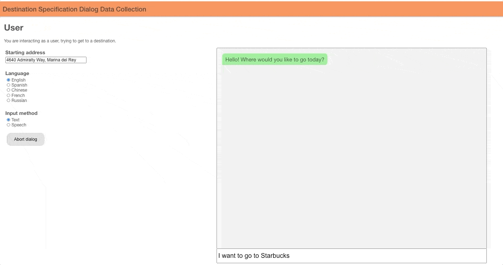

# Multi-Domain End-to-End Platform (MEEP)
  * [Introduction](#introduction)
  * [Demo](#demo)
  * [Installation](#installation)
    + [Backend](#backend)
    + [Frontend](#frontend)
    + [Configuration](#configuration)
  * [30-Second Startup](#30-second-startup)
      - [Start the backend server](#start-the-backend-server)
      - [Start the front-end server](#start-the-front-end-server)
  * [Resources](#resources)

<small><i><a href='http://ecotrust-canada.github.io/markdown-toc/'>Table of contents generated with markdown-toc</a></i></small>

## Introduction
**End-to-end framework to build automatic agents (chatbots) for task-oriented dialogs**

- 💬 Use chat interfaces to collect dialog data and interact with agents
- 🤖 Build/deploy automated chatbot agents with your own ML/rule-based models
- :chart_with_upwards_trend: Evaluate chatbots using 1) agent-action annotations  2) user-satisfaction scores

**Quickly deploy for any domain by leveraging domain-agnostic modules**
- Data collection interface self-annotates dialogs for training/evaluation data
- Train a chatbot without ML knowledge using generic ML models, or write a custom model
- Evaluate any chatbot's accuracy as a black-box, or inspect its internal actions as a white-box

Chat interfaces are deployed with a simple web architecture [more details in a Google drive](https://docs.google.com/presentation/d/1wvpMsL0JgeM_nSvwjvszXRk-Ei0SljzjvghqPtjXXjo/edit#slide=id.g7314e2b87c_0_0).  The backend is Python/Flask/sockets
and the frontend is Preact/Redux.

## Demo
Below is a short snippet of a user interacting with a chatbot that helps them specify a destination
for a taxi ride.



**Live Chatbot:** http://35.212.174.248:9999/0/user. Chat directly with the chatbot here.

## Installation

### Backend
- Tested on python 3.6.3, requires python 3.6+ for the newer versions of the transformers module.

#### Set up a virtual environment (optional, but recommended)
1. `python3 -m venv env`
2. `source env/bin/activate`

#### Install python dependencies (not optional)
3. `pip install -r requirements.txt`
4. This installs server and API dependencies. Some agents require additional installation. See their folders for details or install `requirements-full.txt`.

### Frontend

- Requires Node.js. Tested with Node 12.10

<details>
    <summary>If node is not installed, follow these instructions for Ubuntu</summary>

1. `curl -sL https://deb.nodesource.com/setup_12.x | sudo -E bash -`
2. `sudo apt install nodejs`

[Source](https://linuxize.com/post/how-to-install-node-js-on-ubuntu-18.04/)
</details>

Install the required dependencies.

1. `cd gui/frontend`
2. `npm install`

### Configuration

Backend configuration is all done through command line arguments to main.py.
Run `python main.py --help` for a list of options.
If you are running a domain that requires API keys, you need to create the `gui/backend/keys/api_keys.json` file and set them there.
Here's an example of api_keys.json:
```json
{
  "darksky": "my_api_key1",
  "google_maps": "my_api_key2",
  "google_speech": "my_api_key_file.json",
  "wit_date": "my_api_key3"
}
```

Frontend configuration is done using [dotenv](https://www.npmjs.com/package/dotenv-safe),
stored in the auto-generated configuration file `gui/frontend/.env`.
There is an example at [`gui/frontend/.env.example`](./gui/frontend/.env.example)
You can modify the parameters in this configuration file after it is generated by the front-end
[start-up command](#start-the-front-end-server).
For domains that require frontend API keys (e.g. destination), you should add the keys there.

## 30-Second Startup
Let's start a chat interface for the simple [compare_numbers](./apis/README.md) domain that determines
whether one number is greater than another.

```bash
BACKEND_PORT=8081
FRONTEND_PORT=8082
LOG_DIR=logs/tutorial
```
#### Start the backend server
```bash
cd gui/backend
python main.py --port=$BACKEND_PORT --domain=compare_numbers --num_rooms=1 --log_dir=$LOG_DIR
```
This starts a backend for **human-agents** that make api calls and reply to user utterances via the agent UI.

To see what it's like to interact with a **chatbot-agent**, add `--agent_class_name=agents.compare_numbers_agent.CompareNumbersAgent` to the command above.

#### Start the front-end server
```bash
cd gui/frontend
./run.sh $BACKEND_PORT $FRONTEND_PORT
```
The front-end command will output URLs to access the chat interface, e.g. `http://0.0.0.0:8082`.

## Resources
- [Chat Interface](./gui/README.md)
- [Datasets](./dataset/README.md)
- [Pre-Built and Custom Domains](./apis/README.md)
- [Testing](gui/backend/README.md#unittests)
- [Implement and Evaluate a Custom Agent](agents/README.md)
