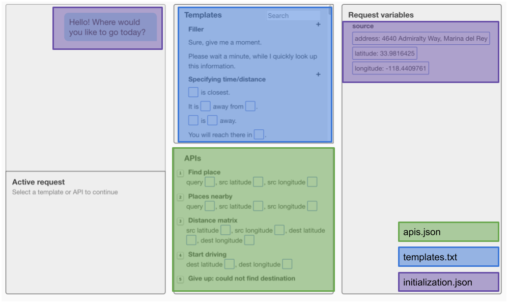
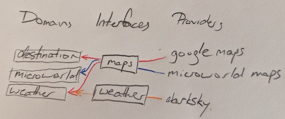

- [Domains](#domains)
- [Definitions](#definitions)
- [Creating a new domain](#creating-a-new-domain)
- [Writing a new API](#writing-a-new-api)
  * [Implement functionality in Providers](#implement-functionality-in-providers)
  * [Implement Interfaces to process parameters](#implement-interfaces-to-process-parameters)
- [Creating the rest of the domain](#creating-the-rest-of-the-domain)
    + [OPTIONAL Additional setup required for extra functions](#optional-additional-setup-required-for-extra-functions)
      - [Runnable logs](#runnable-logs)
      - [Tests](#tests)
- [Run the new domain](#run-the-new-domain)
- [Creating a Chatbot-Agent](#creating-a-chatbot-agent)
- [Appendix: Detailed API Architecture](#appendix--detailed-api-architecture)

<small><i><a href='http://ecotrust-canada.github.io/markdown-toc/'>Table of contents generated with markdown-toc</a></i></small>

# Domains
One key feature of this platform is that it’s flexible enough to be usable to develop bots for arbitrary dialog tasks.

This repo comes with a few pre-built domains:
- `--domain=destination` (default): the main destination interface where the user is ordering a taxi to somewhere they know about
- `--domain=microworld`: another destination interface, but in an offline toy world.
- `--domain=weather`: the user requests information about weather forecasts
- `--domain=compare_numbers`: simple example interface that compares the value of two numbers.

All of the text in boxes is configurable by changing the files in the bottom right.


We will use the `compare_numbers` domain as a working example throughout this document.

# Definitions

| Level     | Definition                                                                                                                                                                   | Examples                                                                                                                                          |
|-----------|------------------------------------------------------------------------------------------------------------------------------------------------------------------------------|---------------------------------------------------------------------------------------------------------------------------------------------------|
| Domain    | The tools available to an agent to fulfil the user’s request.  This is usually a collection of interfaces, templates and other configuration that make up a problem to solve | *destination* - get to a real location<br>*microworld* - get to a location in a fictional world<br>*weather* - answer questions about the weather |
| Interface | A set of functions that abstract out which provider is being used. (This layer also does logging and state management, which is mostly hidden)                               | *maps* - google and microworld maps all expose the same functions<br>*weather*                                                              |
| Provider  | A group of similar functions together, usually from a single external API                                                                                                    | *google maps*<br>*darksky* - a weather API

The relationship between domains and providers is many-to-many. Multiple providers can use the same interface when the functionality is equivalent.



# Creating a new domain

To adapt this platform to your own domain, you will need to do the following:

1. Create any new providers to implement required functionality
2. Implement any new interfaces
3. Create a config file pointing to the templates, list of apis and initialization settings


# Writing a new API

APIs provide functions that connect to databases or do computation.  They are made up of Providers and Interfaces.

## Implement functionality in Providers
Providers perform computation and call external APIs.

They should return a list of dictionaries with `name` and `value` as keys which will be used on the frontend. The dictionary values can be arbitrarily nested with additional name-value dictionaries.
Error values should provide a top-level key with the name `'error'`.

[compare_numbers/compare_numbers_provider.py](./compare_numbers/compare_numbers_provider.py)
```python
class CompareNumbersProvider():
    def compare(self, num1, num2):
        try:
            num1 = float(num1)
            num2 = float(num2)
        except ValueError:
            raise ValueError('numbers must be parsable by python `float`')

        if num1 == num2:
            result = "equal to"
        elif num1 > num2:
            result = "greater than"
        else:
            result = "less than"
        return [{'name': 'comparison', 'value': result}]

    def end_dialog(self):
        return []

    def __repr__(self) -> str:
        '''Return an executable initialization for this class for executable logs'''
        return 'CompareNumbersProvider()'
```
## Implement Interfaces to process parameters
Interfaces process front-end requests for Providers. They should be fairly transparent, but are required to implement logging and variable management.

The `@route` decorator assigns HTTP endpoints to your APIs.
The helper `api_call` wraps the call with logging and variable statefulness.

[compare_numbers/compare_numbers_interface.py](./compare_numbers/compare_numbers_interface.py)
```python
from apis.compare_numbers.compare_numbers_provider import CompareNumbersProvider
from apis.base import BaseInterface
from apis.utils import load_parameter, route, completes_dialog


class CompareNumbersInterface(BaseInterface):
    def __init__(self, *args, **kwargs):
        super().__init__()
        self.provider = CompareNumbersProvider()

    # bind an HTTP endpoint to this function
    @route('/compare_numbers/compare', methods=['POST'])
    def compare(self, request_params):
        number1 = load_parameter(request_params, "number1")
        number2 = load_parameter(request_params, "number2")
        return self.api_call(self.provider.compare,
                             request_params, number1, number2)

    @route('/end_dialog', methods=['POST'])
    @completes_dialog(success=True, confirmation_type='rate_satisfaction')
    def end_dialog(self, request_params):
        return self.api_call(self.provider.end_dialog, request_params)
```

# Creating the rest of the domain
Create a new folder in `../gui/backend/domains` with the name of your domain, e.g.

[../gui/backend/domains/compare_numbers](../gui/backend/domains/compare_numbers) and a file [`config.py`](../gui/backend/domains/compare_numbers/config.py)
```python
# Config file for the compare_numbers domain

import os
import sys
from keys import keys
from domains.domain import Domain

sys.path.append(
    os.path.dirname(
        os.path.dirname(
            os.path.dirname(
                os.path.dirname(
                    os.path.dirname(
                        os.path.abspath(__file__)))))))  # for loading apis

from apis.compare_numbers.compare_numbers_interface import CompareNumbersInterface

# Initialize interfaces
interfaces = [
    CompareNumbersInterface(),
]

# Create a Domain object, which will be used from this file
domain_dir = os.path.dirname(os.path.abspath(__file__))

compare_numbers_domain = Domain(
    'compare_numbers',
    interfaces,
    initialization=domain_dir + '/initialization.json',
    apis=domain_dir + '/apis.json',
    agent_templates=domain_dir + '/agent_templates.txt',
)
```

This config file should initialize the interfaces with any required keys and pointers to the following files:
- [apis.json](../gui/backend/domains/compare_numbers/apis.json): specifies API names and parameters to load in the Agent UI
- [initialization.json](../gui/backend/domains/compare_numbers/initialization.json): a set of initial variables for the agent
- [agent_templates.txt](../gui/backend/domains/compare_numbers/agent_templates.txt): a list of NLG templates for agent communication with braces {} as placesholders.  Braces can contain hints in them, e.g. `{num1} is {comparator} {num2}`

<summary>
### OPTIONAL Additional setup required for extra functions

A bit more setup is required to enable runnable logs and new test cases
<details>

#### Runnable logs

Add any new providers to [`apis/__init__.py`](./__init__.py)

```
from apis.compare_numbers.compare_numbers_provider import CompareNumbersProvider
```

#### Tests

Add your config to [test.py](../gui/backend/tests/test.py)

```
from domains.compare_numbers.config import compare_numbers_domain
```

</details>
</summary>


# Run the new domain
Restart the backend server with --domain=$NAME
```bash
cd ../gui/backend
python main.py --port=8081 --domain=compare_numbers --num_rooms=1 --log_dir=logs/tutorial
```
Restart the frontend (important!)
```
cd ../gui/frontend
./run.sh 8081 8082
```
Refresh frontend URLs. Your new API should be visible now and you can start human-to-human data collection.

# Creating a Chatbot-Agent
You may want interact with an automatic chatbot instead of a human agent.  You can implement your
own custom agent following [agents/README.md](../agents/README.md).  There is an example of a
simple rule-based implementation that uses these interfaces in [compare_numbers_agent.py](../agents/compare_numbers_agent.py)

To run this agent, restart the backend server with this command:
```bash
cd ../gui/backend
python main.py --port=8081 --domain=compare_numbers --num_rooms=1 --log_dir=logs/tutorial \
    --agent_class_name=agents.compare_numbers_agent.CompareNumbersAgent
```
# Appendix: Detailed API Architecture

```
          interface - provider
        /
manager               provider
        \           /
          interface
                    \ provider
```

The *Manager* manages all API services. It maintains:
- Shared variables for the frontend
- Variable counters for logging

The *Interfaces* abstract API access, and can be used to abstract out differences between external API services, such as GoogleMaps vs MicroworldMaps.
Each should inherit from BaseInterface and call `api_call`. Interfaces do the following:
- Logging
- Statefulness
- Query parsing

The *Providers* actually implement the API logic. This can include calling external services, querying a database and other complex logic.

Example:
```
          CompareNumbersInterface - CompareNumbersProvider
        /
manager
        \                 GMapsProvider
         \              /
          MapsInterface
                        \
                          MicroworldMapProvider
```

- The frontend, which needs to maintain state and do logging accesses the Manager and Interfaces
- Agents, which get passed variables at every turn, access only the interfaces
- Services that do not require logging, such as replaying the logs, should access only the providers
