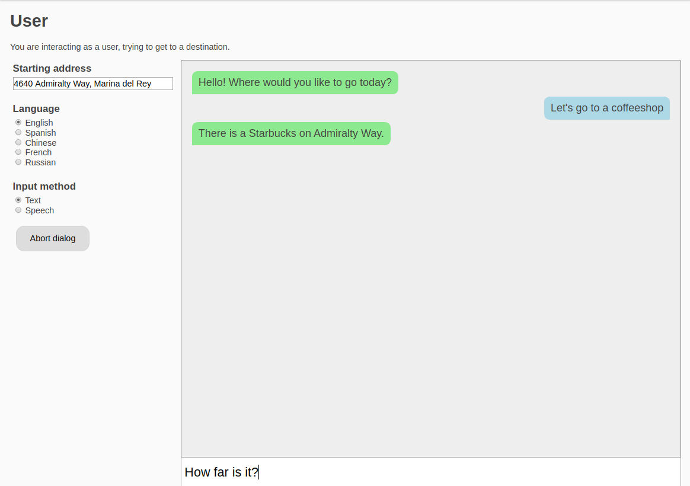
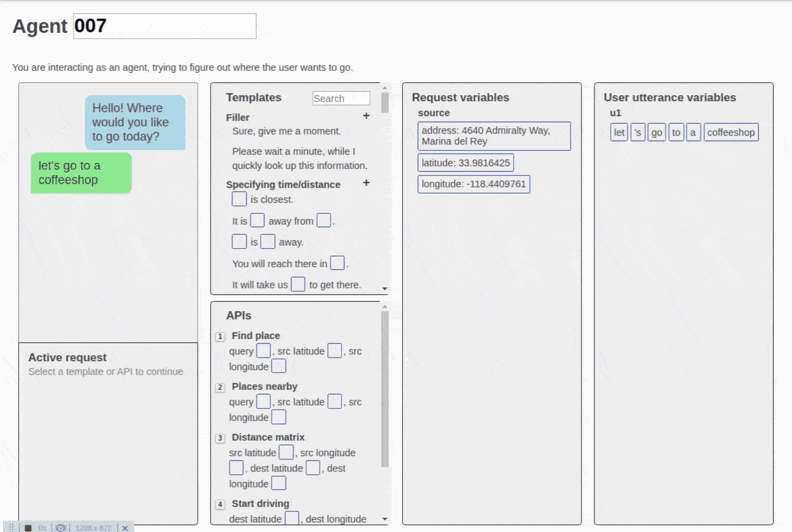
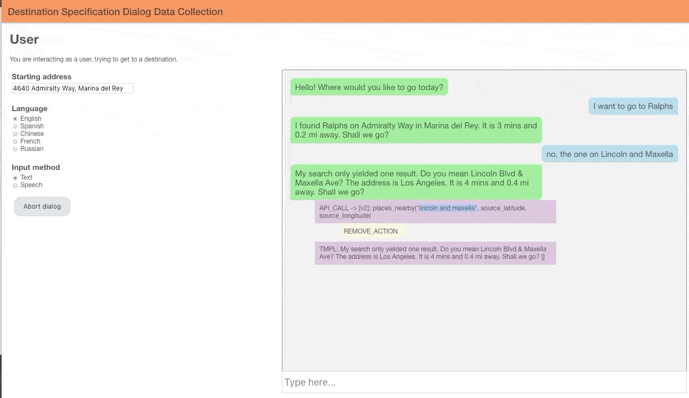
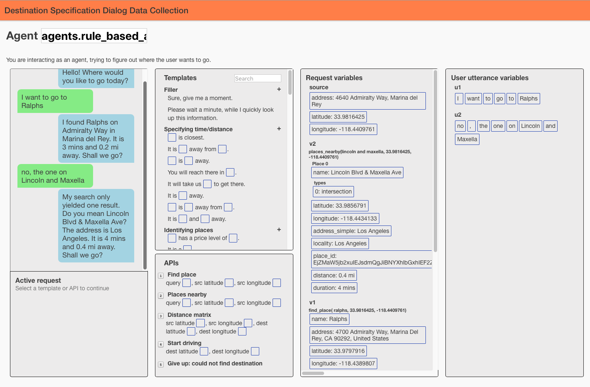
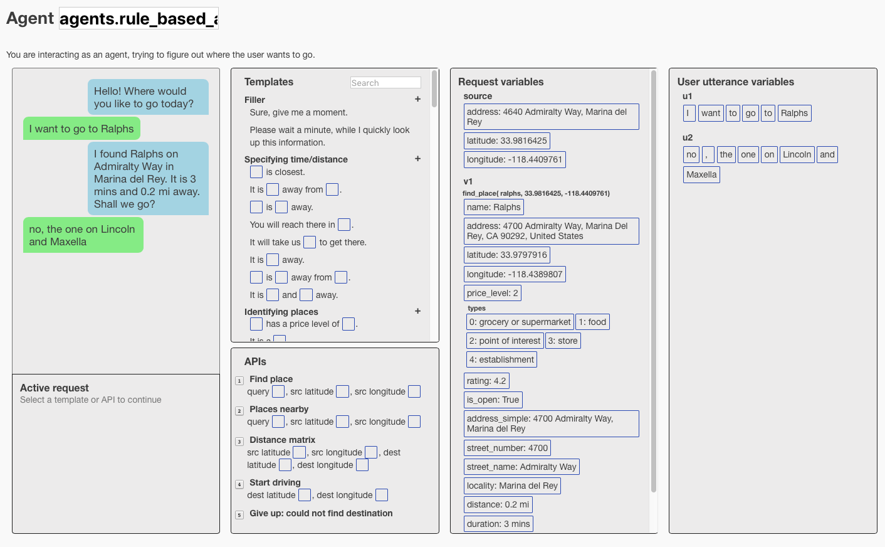

- [Human-to-Human Chat Interface](#human-to-human-chat-interface)
    + [API Calls](#api-calls)
    + [NLG Templates](#nlg-templates)
    + [API and Template Parameters](#api-and-template-parameters)
    + [Agent UI keyboard shortcuts](#agent-ui-keyboard-shortcuts)
- [Human-to-Bot Chat Interface](#human-to-bot-chat-interface)

<small><i><a href='http://ecotrust-canada.github.io/markdown-toc/'>Table of contents generated with markdown-toc</a></i></small>

## Human-to-Human Chat Interface
The human-to-human interface collects dialogs between human users and human agents.
These dialogs are [self-annotated](../dataset/README.md) and can be used as chatbot training or evaluation data.

The user interface is simply a chat window to communicate the user's intent.  Green bubbles are
sent by the agent, blue bubbles by the user.

A human agent responds to user messages by issuing **API** calls and using natural-language generation
(NLG) **templates**.

#### API Calls
Here, the agent issues the "Find place" API call, which returns the nearest coffeeshop (Starbucks).

#### NLG Templates
Next, the agent responds in plain-english by selecting a NLG template.

#### API and Template Parameters
Note that both API calls and NLG templates have parameters that are filled from:
- Request variables: return values from previous API calls
- User utterance variables: word-tokens from user messages

#### Agent UI keyboard shortcuts
⚡️ Some keyboard shortcuts to speed up responses:
- <kbd>1</kbd> through <kbd>0</kbd> select APIs
- <kbd>Tab</kbd> selects between slots in the active request
- <kbd>Enter</kbd> or <kbd>Space</kbd> sends the active request
- <kbd>q</kbd> queues the current message for the agent instead of sending it
- <kbd>Esc</kbd> cancels the active request
- <kbd>/</kbd> focuses the search bar (think Vim) and let you use numbers to select templates, and <kbd>Esc</kbd> will unfocus
- <kbd>\`</kbd> or <kbd>\~</kbd> fills the source latitude (think \~ is HOME in Bash)

## Human-to-Bot Chat Interface
We can also [build chatbot-agents](../agents/README.md) and deploy them to replace
human-agents with the same chat interface.  Human-to-bot dialogs are logged and self-annotated similarly to human-to-human dialogs.
You can interact with a live chatbot-agent at http://35.212.174.248:9999/0/user.

A demonstration of the ability to debug chatbot-agent actions via the /user interface is shown below.

Mouse-clicking on the green boxes containing agent utterances reveals the sequence of purple agent actions that produced it. Further clicking on the purple boxes, we can optionally backtrack by removing an agent action.  Similarly, we remove the first user utterance in the blue box and replace it with a less ambiguous one: "*Ralphs on Lincoln and Maxella*".

We can also inspect agent actions via the /agent UI, e.g. http://35.212.174.248:9999/0/agent.
Since this is an automated bot-agent, we need not perform any actions as humans, though we can choose to intervene and course-correct.

The before/after images below illustrate the effect of removing the *places-nearby* agent-action: the `v2` variable is removed from the "Request variables" list.

**Before places-nearby action removal: v2 variable exists**

**After places-nearby action removal: v2 variable is removed**

The conversations between the automated bot and the human user are logged in the same format as human-to-human dialogs. These self-annotated dialogs can be used as additional training data.

**Experimental Alternate Actions** The [gpt-agent](../agents/gpt2_agent/agent.py) for the `destination` domain implements an experimental beam-search for alternate agent-actions that can be selected in addition to "REMOVE_ACTION" in the /user UI.  It
is implemented in the `on_message_with_alternate_events` function.  This let's a human user course-correct using
agent-learned actions without having to access the /agent UI.
